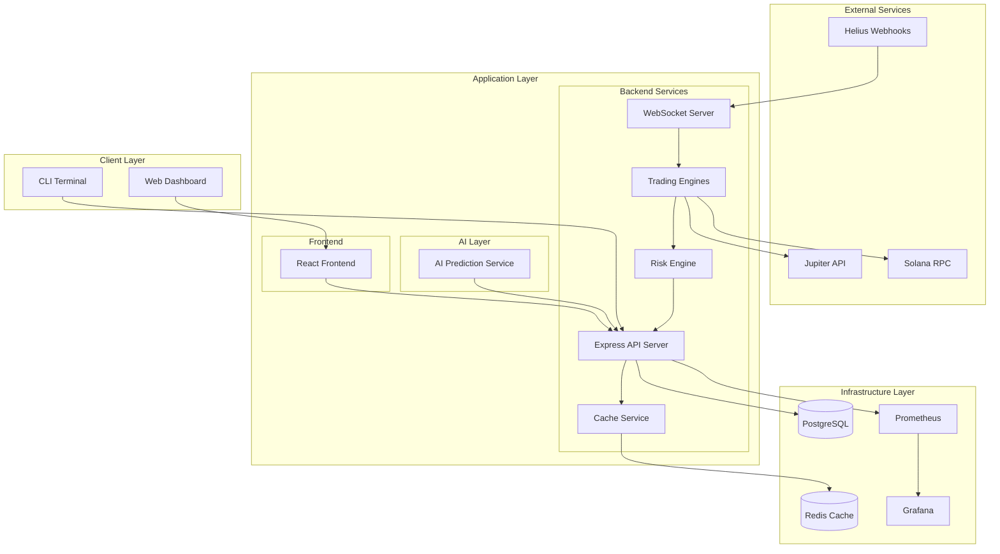
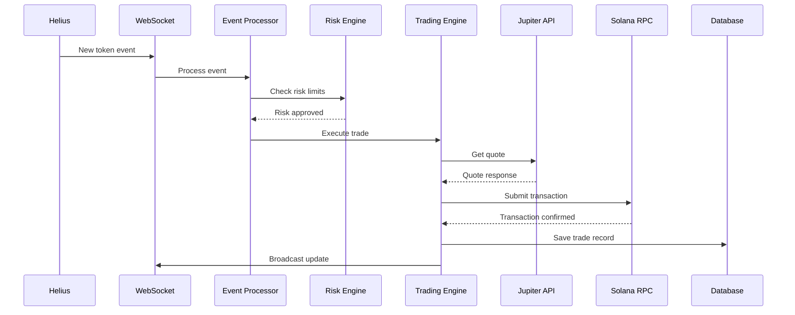
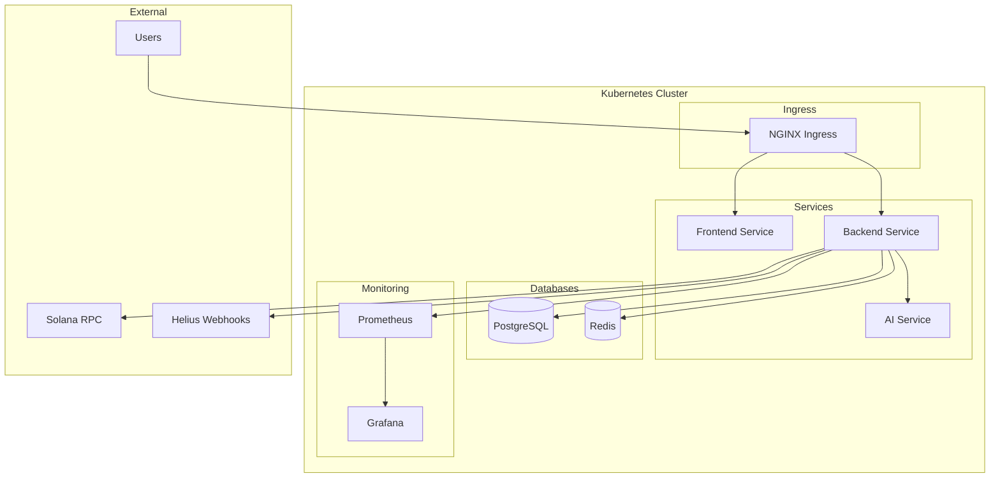
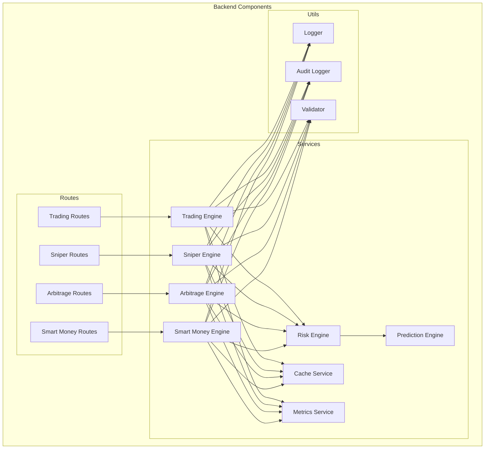

# Architecture Diagrams

## System Architecture Overview

```mermaid
graph TB
    subgraph "External Services"
        SOLANA[Solana RPC]
        HELIUS[Helius Webhooks]
        JUPITER[Jupiter API]
    end

    subgraph "Infrastructure Layer"
        POSTGRES[(PostgreSQL)]
        REDIS[(Redis Cache)]
        PROMETHEUS[Prometheus]
        GRAFANA[Grafana]
    end

    subgraph "Application Layer"
        subgraph "Backend Services"
            API[Express API Server]
            WS[WebSocket Server]
            ENGINE[Trading Engines]
            RISK[Risk Engine]
            CACHE[Cache Service]
        end

        subgraph "AI Layer"
            AI[AI Prediction Service]
        end

        subgraph "Frontend"
            WEB[React Frontend]
        end
    end

    subgraph "Client Layer"
        CLI[CLI Terminal]
        DASHBOARD[Web Dashboard]
    end

    %% Connections
    HELIUS --> WS
    WS --> ENGINE
    ENGINE --> RISK
    RISK --> API
    API --> CACHE
    CACHE --> REDIS
    API --> POSTGRES
    ENGINE --> JUPITER
    ENGINE --> SOLANA
    AI --> API
    WEB --> API
    CLI --> API
    DASHBOARD --> WEB
    API --> PROMETHEUS
    PROMETHEUS --> GRAFANA
```

## Data Flow Architecture

```mermaid
sequenceDiagram
    participant H as Helius
    participant WS as WebSocket
    participant E as Event Processor
    participant R as Risk Engine
    participant T as Trading Engine
    participant J as Jupiter API
    participant S as Solana RPC
    participant DB as Database

    H->>WS: New token event
    WS->>E: Process event
    E->>R: Check risk limits
    R-->>E: Risk approved
    E->>T: Execute trade
    T->>J: Get quote
    J-->>T: Quote response
    T->>S: Submit transaction
    S-->>T: Transaction confirmed
    T->>DB: Save trade record
    T->>WS: Broadcast update
```

## Deployment Architecture

```mermaid
graph TB
    subgraph "Kubernetes Cluster"
        subgraph "Ingress"
            IG[NGINX Ingress]
        end

        subgraph "Services"
            FE[Frontend Service]
            BE[Backend Service]
            AI[AI Service]
        end

        subgraph "Databases"
            PG[(PostgreSQL)]
            RD[(Redis)]
        end

        subgraph "Monitoring"
            PROM[Prometheus]
            GRAF[Grafana]
        end
    end

    subgraph "External"
        USER[Users]
        RPC[Solana RPC]
        WEBHOOKS[Helius Webhooks]
    end

    USER --> IG
    IG --> FE
    IG --> BE
    BE --> AI
    BE --> PG
    BE --> RD
    BE --> RPC
    BE --> WEBHOOKS
    BE --> PROM
    PROM --> GRAF
```

## Component Architecture

```mermaid
graph TD
    subgraph "Backend Components"
        subgraph "Routes"
            TR[Trading Routes]
            SR[Sniper Routes]
            AR[Arbitrage Routes]
            SMR[Smart Money Routes]
        end

        subgraph "Services"
            TE[Trading Engine]
            SE[Sniper Engine]
            AE[Arbitrage Engine]
            SME[Smart Money Engine]
            RE[Risk Engine]
            PE[Prediction Engine]
            CS[Cache Service]
            MS[Metrics Service]
        end

        subgraph "Utils"
            LOG[Logger]
            AUD[Audit Logger]
            VAL[Validator]
        end
    end

    TR --> TE
    SR --> SE
    AR --> AE
    SMR --> SME
    TE --> RE
    SE --> RE
    AE --> RE
    SME --> RE
    RE --> PE
    TE --> CS
    SE --> CS
    AE --> CS
    SME --> CS
    TE --> MS
    SE --> MS
    AE --> MS
    SME --> MS
    TE --> LOG
    SE --> LOG
    AE --> LOG
    SME --> LOG
    TE --> AUD
    SE --> AUD
    AE --> AUD
    SME --> AUD
    TE --> VAL
    SE --> VAL
    AE --> VAL
    SME --> VAL
```